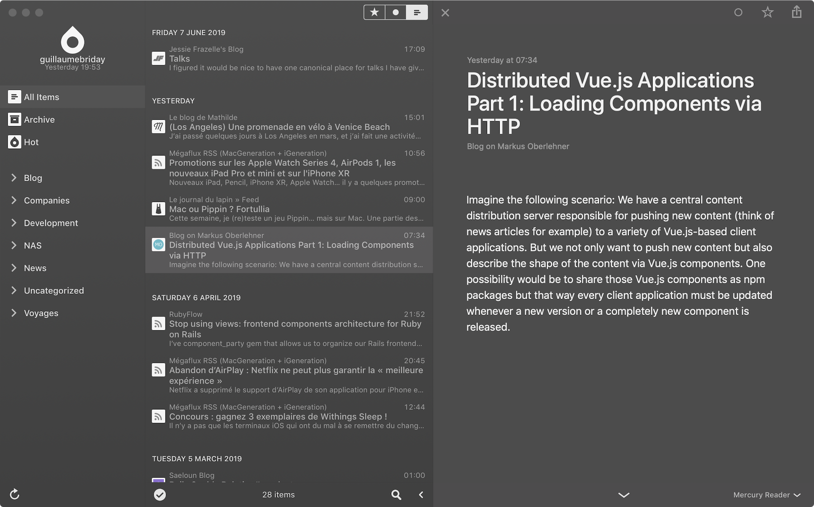
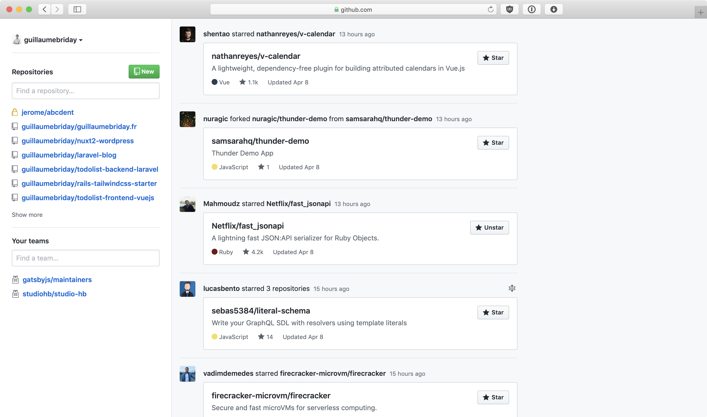

On me demande souvent comment je fais ma veille, quelles sont mes astuces et les outils que j'utilise pour y parvenir. Comment j'ai mis plusieurs années pour avoir un résultat qui me convienne ? Je vais essayer de répondre et de détailler tout cela dans cet article.

L'article va principalement parler de la veille autour du monde du Web et des sujets qui m'attirent le plus, mais je pense que c'est applicable à presque tous les domaines de votre choix.

## 1. Par où commencer ?

Il est important de se rappeler que trouver les sources (de bonnes sources) ne se fera pas en quelques jours ni même en quelques mois. En effet, si vous commencez à lire des sources dans un premier temps cela ne veut pas dire que le contenu va vous plaire sur le long terme. Il va falloir en permanence se renouveler, trouver des sources qui vous intéressent davantage et supprimer celles qui vous polluent.

Comme dans les relations sociales, **de bonnes sources amènent souvent vers d'autres bonnes sources**. Ces personnes inspirantes vont souvent vous amener vers d'autres sources ou relations très intéressantes également ! Il est important de faire le tri régulièrement pour créer ce cercle vertueux dans votre veille.

Faire de la veille correctement m'a permis de découvrir des personnes absolument fantastiques qui ont soif de partager leur savoir.

Cela doit nous permettre de savoir ce qu'il se fait, de voir comment les autres font et ainsi se remettre en question, éviter de réinventer la roue. On pourra également savoir quelles sont les dernières nouveautés, les mises à jour à faire sur nos différents projets ou serveurs, savoir ce qui peut être remplacé ou même supprimé. On pourra alors avoir un code ou une architecture plus propre tout en gagnant du temps sur les prochains développements, car on aurait fait le lien entre plusieurs idées vu pendant notre veille.

De manière plus générale, **c'est rester en éveil pour s'inspirer des autres**. Certains articles ou projets vous donnerons des idées que vous voudrez mettre en place à votre niveau par la suite.

## 2. Trouver des sources pertinentes

Comme je le disais plus haut, il n'y a pas de recette miracle ni une liste de ressources prêtes à l'emploi. Chacun doit faire sa veille en fonction de ses envies et de ses besoins. Il va falloir mélanger les sources et ses horizons pour savoir ce que vous voulez.

Tout d'abord, j'ai plusieurs points d'entrée qui n'ont pas beaucoup changés avec le temps.

### Twitter

En exagérant un peu, je ne pourrais me servir que de lui.

Presque tous les développeurs et autres acteurs du Web sont sur Twitter. Ils partagent leur expérience en temps réel (ou presque), mais également **des ressources**, des idées ou des questionnements. On y trouve généralement des informations sur la roadmap des projets open source, des débats très intéressants qui peuvent remettre en cause ou expliquer des choix techniques qui seront implémentés plus tard sur ces projets. En effet, beaucoup ne passent que par Twitter pour partager des choses qu'ils n'auraient jamais partagé ailleurs. Par exemple quand [@dhh](https://twitter.com/dhh) a expliqué pourquoi les [source maps étaient activées par défaut dans Rails 6](https://twitter.com/dhh/status/1089943231553388544).

Plusieurs fois par jour, je vois des tweets dans lesquels un développeur détaille une petite astuce qu'il a trouvé dans un framework ou sur une technologie. Elle ne mérite pas forcement un article dédié et je ne l’aurai probablement jamais trouvé autrement.

Autre exemple, il y a quelques temps, [ce tweet](https://twitter.com/samantha_ming/status/1070705242101043200) s'est retrouvée dans mon fil d'actualité. J'ai découvert qu'on pouvait faire `console.table`à la place du `console.log` habituel pour les objets et les tableaux. Désormais, pas un jour ne passe sans que j’utilise cette fonction, mais j'aurais très bien pu faire sans. Ça aurait simplement été dommage.

J'aurai pu en rester là avec ce tweet, mais la curiosité m'a poussé à creuser un peu et c'est là qu'on peut découvrir des choses vraiment chouettes.

Ce tweet faisait partie d'une série d'astuces que [@samantha_ming](https://twitter.com/samantha_ming) donnait quotidiennement et j'ai appris comme ça pleins de petites astuces.

J'ai vu qu'elle avait également un blog et qu'elle retweetait d'autres comptes intéressants.

Et c'est surtout ça la force de Twitter, on y trouve beaucoup de **liens externes**. Vers des blogs, parfois complètement inconnus, mais très détaillés ou spécifiques, également vers des projets open source, vers des conférences ou encore des bouts de code à tester en ligne directement !

Il ne faut surtout pas s'arrêter aux tweets seulement, mais penser à suivre les liens, regarder les personnes que suivent ces gens ainsi que les retweets
qu'ils peuvent faire pour les suivre à notre tour et ainsi de suite.

### Les blogs et les flux RSS

Je trouve des blogs par plusieurs moyens. Quand je cherche une solution à un problème précis sur Google ou plus d'informations sur un point particulier d'une technologie ou d'un sujet, on trouve beaucoup de super blogs expliquant très bien ce que l'on attend. On peut avoir de bonnes surprises, parfois moins.

Généralement si un article vous a plu, les autres du même blog pourraient également vous plaire, il ne faut pas hésiter à **revenir à la liste des articles** ou des catégories pour en savoir un peu plus.

Avec un peu de chance, on retrouve des liens vers d'autres blogs ou ressources qui ont permis à l'auteur de rédiger son article. Dans ce cas, rebelote, *j'ouvre tous les liens dans des onglets* et je jette un oeil à chacun d'entre eux. Ça semble long, mais avec de la pratique, je ne reste pas plus de deux ou trois secondes sur une page d'accueil pour savoir si les sujets abordés valent la peine d'y passer plus de temps.

Parcourir tous ces liens, comme le ferait un robot Google, m'a vraiment permis de découvrir une quantité incroyable de sujets, d'astuces et de **bonnes pratiques**.

Pour les blogs retenus, je *m'abonne aux flux RSS* s'il y en a un ou/et au compte twitter de l'auteur. Tant pis pour les blogueurs qui n'ont ni l'un ni l'autre et tant pis pour moi, car je perds une ressource utile.

De plus, la plupart du temps, on retrouve un blog maintenu par les entreprises ou la communauté qui édite les logiciels ou les services qu'on utilise régulièrement. Pour ne citer qu'eux, il y a celui de [GitHub](https://github.blog), celui de [Laravel](https://blog.laravel.com), [Gitlab](https://about.gitlab.com/blog/) ou de [SIGNAL V. NOISE](https://m.signalvnoise.com). On découvre beaucoup d'informations autour de l'écosystème correspondant et tout cela regroupé au même endroit dans notre flux RSS.

### GitHub

GitHub est une vraie mine d'or pour faire de la veille. La plupart des projets open-source sont partagés sur cette plateforme et le dashboard permet de faire des découvertes de milliers de dépôts et de développeurs.

C'est plus ou moins le même processus que j'adopte avec Twitter. Il faut suivre des comptes intéressants et qui sont actifs.

Le dashboard nous remonte plusieurs informations qu'il va falloir analyser.

On peut voir les personnes qui nous ont suivi ainsi que les abonnements des comptes que vous suivez. Il ne faut pas hésiter à aller voir leur profil et leurs projets. Souvent les personnes peu connues ont des projets très complets. En les parcourant rapidement, vous pourrez trouver des pratiques ou des astuces qui ne sont pas forcément documentées ou répertoriées ailleurs que dans le code.

Les projets qui reçoivent une "star" ou les forks des comptes que vous suivez sont aussi à aller voir. C'est souvent pour moi, le seul moyen de découvrir des projets ou des écosystèmes entiers.

Si vraiment vous avez le temps, on peut faire de belles découvertes en allant voir les *contributeurs des projets*. Si les personnes sont actives sur un projet qui vous plait, il y a de fortes chances que les "stars" qu'ils ont mis et les personnes qu'ils suivent le soient également.

Enfin, l'onglet [Explore](https://github.com/explore), comme son nom l'indique, permet de découvrir des repositories. On peut trier par topic, par framework ou voir les tendances de la semaine ou du mois.

Par exemple, on pourra voir [les tendances de la semaine en Ruby](https://github.com/trending/ruby?since=weekly) ou encore découvrir ce qu'il se fait dans [les Topics de notre choix](https://github.com/topics).

Et enfin, pour conclure avec GitHub, il existe une quantité titanesque d'[Awesome Lists](https://github.com/topics/awesome). Ces repositories un peu particuliers, ne servent qu'à répertorier des outils ou des ressources sur des sujets en particulier.

Par exemple, en voici une pour [Vue.js](https://github.com/vuejs/awesome-vue), une autre pour découvrir des [framework CSS](https://github.com/troxler/awesome-css-frameworks) ou encore une pour trouver des applications pour [s'auto-héberger](https://github.com/Kickball/awesome-selfhosted).

### Agrégateurs de liens

Les agrégateurs de liens sont des sites qui vont répertorier des sources externes. Ils sont pratiques, car ils laissent souvent la possibilité à la communauté de poster publiquement leurs propres liens et on a donc beaucoup de sources variées, faciles d'accès sur le même site.

Par exemple, [RubyFlow](http://www.rubyflow.com), [Hacker News](https://news.ycombinator.com) ou encore [Lobsters](https://lobste.rs). Vous pourrez trouver des concepts similaires sur certains blogs et sur Reddit également.

[Lobsters](https://github.com/lobsters/lobsters) est open-source et permet donc d'être auto-hébergé. J'ai mis à disposition un Lobsters personnel sur [https://lobsters.guillaumebriday.me](https://lobsters.guillaumebriday.me). J'y partage tout ce que je retiens d'intéressant ou qui est assez notable pour que cela soit partagé. N'hésitez pas à vous abonner au flux RSS !

### Revue de code

Si vous avez l'occasion de faire de la revue de code en entreprise ou sur des sides projects, alors prenez ce temps. La revue de code permet de découvrir des pattern, de nouvelles façons de coder, de valider ses acquis en faisant des retours et en aillant des débats avec les autres collaborateurs.

Sans même m'en rendre compte, j'ai pu découvrir des méthodes et classes de Ruby par exemple, mais également des idées pour refactoriser mon propre code simplement en regardant le code des autres.

### Les conférences et les Meetups

Si vous aimez la vraie vie et que votre localisation le permet, vous pouvez rejoindre des meetups et assister à des conférences près de chez vous.

Cela permettra de rencontrer des développeurs avec qui vous pourrez échanger vos retours d’expériences et faire de superbes rencontres.

## 3. Mettre en place des outils adaptés

On n'aura pas toujours le temps de lire un article ou un blog qu'on vient de trouver ni le temps de parcourir les stars d'un compte GitHub.

Je pense qu'on peut s'en sortir avec, à minima, deux outils. Un lecteur de flux RSS et une application qui permet de gérer des liens sauvegardés comme [Pocket](https://getpocket.com).

Pour gérer mes flux RSS, j'utilise l'application [Reeder](http://reederapp.com), car elle est disponible sur macOS et iOS gratuitement et elle est super simple d'utilisation. Le flux RSS va vous permettre d'agréger en un seul endroit tous les blogs et les agrégateurs de liens dont on a parlé plus haut. Il ne vous affichera que les articles que vous n'avez pas lu et téléchargera les nouveaux tout seul sans avoir à aller sur chacun des sites à la main.

J'auto-héberge [Miniflux](https://miniflux.app) qui me permet de synchroniser la lecture de mes flux entre tous mes appareils, à savoir ce que j'ai déjà lu sur mon mac n'apparaîtra pas sur mon iPad ou iPhone et inversement. Je peux donc faire de la veille n'importe où sans avoir à retrier les informations entre mes appareils. C’est optionnel et tout peut se faire sur un appareil bien sûr mais c’est moins pratique.

Pour sauvegarder mes liens que je lirai plus tard, j'utilise actuellement [Wallabag](https://www.wallabag.org/en) que j'auto-héberge également. Il est très pratique, car il est bien intégré à iOS et me permet de sauvegarder un article sans même ouvrir l'application.

## 4. Pour conclure

Je suis conscient que ça prend pas mal de temps, mais cela me permet de rester informé et de m’ouvrir sur de nombreux sujets.

Et vous, comment faites-vous votre veille ?

