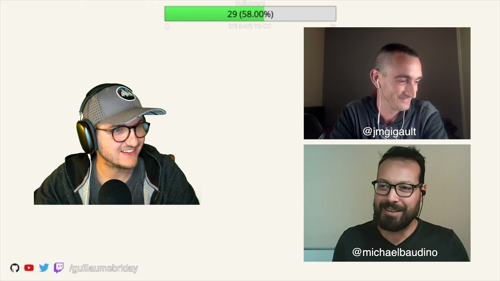

J'écoute des Podcast depuis plus de dix ans maintenant et ce format m'a toujours plu. Je suis un passionné du Web et j'ai envie de parler de beaucoup de sujets, il fallait que je me lance !

Je fais déjà un blog sur lequel je vais continuer de partager des articles et le Podcast viendra en complément sur des sujets qui se prêtent davantage à l'oral je pense. Beaucoup de choses arrivent tant sur le blog que sur le Podcast et j'ai hâte de publier tout ce contenu rapidement.

Le premier épisode est déjà en ligne sur la nouvelle [page dédiée au Podcast](/podcast) 🎙.

Tous les épisodes seront disponibles sur [cette page](/podcast) donc ainsi que sur [ma chaine Youtube](https://www.youtube.com/watch?v=C0wsEEnT0bE&list=PLZnobmDTM15ktSx7eAyL5CYYLqp-aR7TC). Il y a également un [flux RSS](/podcast.xml) dédié pour ne rien rater.

Pensez à vous abonner sur les différents support si ce n'est pas déjà fait 😉.

L'idée est de parler des actualités du moment, mais aussi de Tech, de Business, de produits, et DevOps et plein d'autres choses pour retrouver cette sensation qu'on avait lors des discussions en [Meetup](https://www.meetup.com/LyonRB/) ou en conférences avec d'autres acteurs du Web.

J'espère que le premier épisode vous plaira, bonne écoute !
